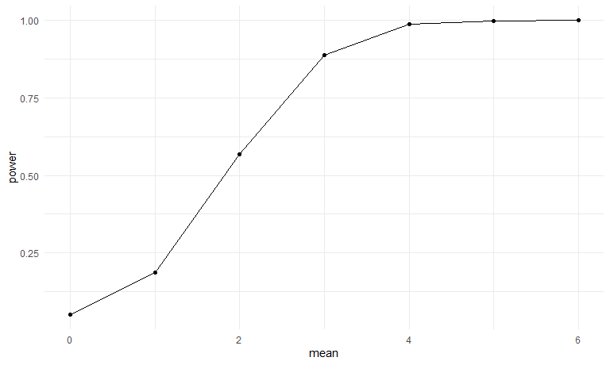
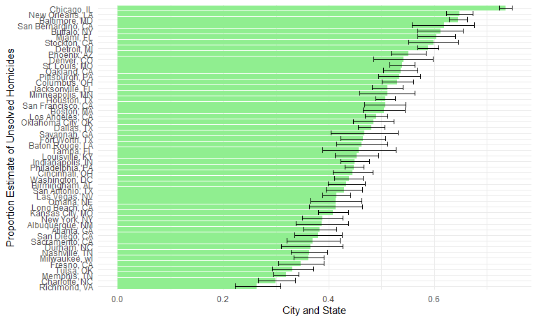

p8105_hw5_rw3031
================
Polly Wu (rw3031)
2024-11-03

# Problem 1

## simulation for birthday duplicate check

``` r
birthday_dup = function(n){
 date_list = sample(1:365, n, replace = TRUE)
 
 dup_btd = any(duplicated(date_list))

 return(dup_btd)
}

birthday_sim_df=
expand_grid(
  n=c(2:50),
  iter = 1:10000)|>
  mutate(
    output = map(n,birthday_dup))|>
  unnest(output)
```

## compute the probabilty of birthday duplicates

``` r
btd_dup_df=
birthday_sim_df|>
  group_by(n,output)|>
  summarise(count = n())|>
  pivot_wider(
    values_from = count,
    names_from = output,
    names_prefix = "count_"
  )|>
  rename(group_size=n)|>
  mutate(
    probability_of_dup = count_TRUE/10000
  )|>
  select(group_size,probability_of_dup)
```

    ## `summarise()` has grouped output by 'n'. You can override using the `.groups`
    ## argument.

``` r
btd_dup_df
```

    ## # A tibble: 49 × 2
    ## # Groups:   group_size [49]
    ##    group_size probability_of_dup
    ##         <int>              <dbl>
    ##  1          2             0.0024
    ##  2          3             0.0085
    ##  3          4             0.0167
    ##  4          5             0.0267
    ##  5          6             0.0399
    ##  6          7             0.0521
    ##  7          8             0.0751
    ##  8          9             0.0925
    ##  9         10             0.116 
    ## 10         11             0.139 
    ## # ℹ 39 more rows

## plot on relationship between sample size and probability of duplicates

``` r
btd_dup_df|>
  ggplot(aes(x=group_size, y=probability_of_dup))+geom_point()+geom_smooth()+
  labs(x="group size", y="probability of duplicate birthdays")
```

    ## `geom_smooth()` using method = 'loess' and formula = 'y ~ x'


The graph indicates that the group size is linearily associated with the
log of the probability of duplication within birth dates.

# Problem 2

## simulate the t-test

``` r
t_test = function(mu){
  
  n=30
  sigma = 5
  
  x=rnorm(n,mean=mu,sd=sigma)
  
  ttest_output = t.test(x,mu=0, conf.level = 0.95)|>
              broom::tidy()
  
  return(ttest_output)
}
```

``` r
ttest_sim_df=
expand_grid(
  mu=c(0:6),
  iter = 1:5000)|>
  mutate(
    ttest_output = map(mu, t_test))|>
  unnest(ttest_output)
```

## plot for power and mu

``` r
ttest_sim_df|>
  mutate(
    reject = ifelse(p.value < 0.05, 1, 0)
  )|>group_by(mu,reject)|>
  summarise(reject_count =n())|>
  filter(reject == 1)|>
  mutate(power = reject_count/5000)|>
  ggplot(aes(x=mu, y=power))+geom_point()+geom_line()+
  labs(x="mean")
```

    ## `summarise()` has grouped output by 'mu'. You can override using the `.groups`
    ## argument.



From the plot, we found that the power increases when the true value of
mu increases. Since our standard deviation is constant, the effect size
increases as our mean increases. As effect size increases, the power of
the t-test also increases.

# Problem 3

``` r
homicide = 
  read_csv("./homicide-data.csv")
```

    ## Rows: 52179 Columns: 12
    ## ── Column specification ────────────────────────────────────────────────────────
    ## Delimiter: ","
    ## chr (9): uid, victim_last, victim_first, victim_race, victim_age, victim_sex...
    ## dbl (3): reported_date, lat, lon
    ## 
    ## ℹ Use `spec()` to retrieve the full column specification for this data.
    ## ℹ Specify the column types or set `show_col_types = FALSE` to quiet this message.

``` r
head(homicide)
```

    ## # A tibble: 6 × 12
    ##   uid   reported_date victim_last victim_first victim_race victim_age victim_sex
    ##   <chr>         <dbl> <chr>       <chr>        <chr>       <chr>      <chr>     
    ## 1 Alb-…      20100504 GARCIA      JUAN         Hispanic    78         Male      
    ## 2 Alb-…      20100216 MONTOYA     CAMERON      Hispanic    17         Male      
    ## 3 Alb-…      20100601 SATTERFIELD VIVIANA      White       15         Female    
    ## 4 Alb-…      20100101 MENDIOLA    CARLOS       Hispanic    32         Male      
    ## 5 Alb-…      20100102 MULA        VIVIAN       White       72         Female    
    ## 6 Alb-…      20100126 BOOK        GERALDINE    White       91         Female    
    ## # ℹ 5 more variables: city <chr>, state <chr>, lat <dbl>, lon <dbl>,
    ## #   disposition <chr>

The raw dataset have 12 variables and 52179 observations. The variables
in the dataset includes uid, reported_date, victim_last, victim_first,
victim_race, victim_age, victim_sex, city, state, lat, lon, disposition.

## total number of homicides across city

``` r
homicide=
homicide|>
  mutate(state = ifelse(city == "Tulsa", "OK", state),
         city_state = paste(city, state, sep=", "))
 
total_homi=
  homicide|>
  group_by(city_state)|>
  summarise(total_n_homicide = n())

unsolved_homi=
  homicide|>
  group_by(city_state)|>
  filter(disposition %in% c("Closed without arrest","Open/No arrest"))|>
  summarise(unsolved_n_homicide = n())

homi_count = 
  total_homi|>
  left_join(unsolved_homi)
```

    ## Joining with `by = join_by(city_state)`

``` r
homi_count
```

    ## # A tibble: 50 × 3
    ##    city_state      total_n_homicide unsolved_n_homicide
    ##    <chr>                      <int>               <int>
    ##  1 Albuquerque, NM              378                 146
    ##  2 Atlanta, GA                  973                 373
    ##  3 Baltimore, MD               2827                1825
    ##  4 Baton Rouge, LA              424                 196
    ##  5 Birmingham, AL               800                 347
    ##  6 Boston, MA                   614                 310
    ##  7 Buffalo, NY                  521                 319
    ##  8 Charlotte, NC                687                 206
    ##  9 Chicago, IL                 5535                4073
    ## 10 Cincinnati, OH               694                 309
    ## # ℹ 40 more rows

## proportion estimate for Baltimore

``` r
baltimore=
homi_count |>
  filter(city_state == "Baltimore, MD")

prop.test(n=pull(baltimore,total_n_homicide), x=pull(baltimore,unsolved_n_homicide))|>
  broom::tidy()|>
  select(estimate, conf.low, conf.high)
```

    ## # A tibble: 1 × 3
    ##   estimate conf.low conf.high
    ##      <dbl>    <dbl>     <dbl>
    ## 1    0.646    0.628     0.663

For Baltimore, the estimated proportion of unsolved homicides is 0.6456
and the confidence intervals is 0.6276 and 0.6632.

## proportion estimate for each city

``` r
prop_test_cities =
homi_count|>
  mutate(test_result = purrr::map2(unsolved_n_homicide, total_n_homicide, ~ prop.test(x = .x, n = .y)))|>
  mutate(test_result=purrr::map(test_result, broom::tidy))|>
  unnest(test_result)|>
  select(city_state,estimate,conf.low,conf.high)

prop_test_cities
```

    ## # A tibble: 50 × 4
    ##    city_state      estimate conf.low conf.high
    ##    <chr>              <dbl>    <dbl>     <dbl>
    ##  1 Albuquerque, NM    0.386    0.337     0.438
    ##  2 Atlanta, GA        0.383    0.353     0.415
    ##  3 Baltimore, MD      0.646    0.628     0.663
    ##  4 Baton Rouge, LA    0.462    0.414     0.511
    ##  5 Birmingham, AL     0.434    0.399     0.469
    ##  6 Boston, MA         0.505    0.465     0.545
    ##  7 Buffalo, NY        0.612    0.569     0.654
    ##  8 Charlotte, NC      0.300    0.266     0.336
    ##  9 Chicago, IL        0.736    0.724     0.747
    ## 10 Cincinnati, OH     0.445    0.408     0.483
    ## # ℹ 40 more rows

## plot for proportion estimate and confidence interval

``` r
prop_test_cities|>
  arrange(desc(estimate))|>
  ggplot(aes(y=fct_reorder(city_state,estimate), x=estimate))+geom_bar(stat="identity", fill="lightgreen")+
  geom_errorbar(aes(xmin=conf.low, xmax =conf.high))+
  labs(x="City and State", y="Proportion Estimate of Unsolved Homicides")
```


