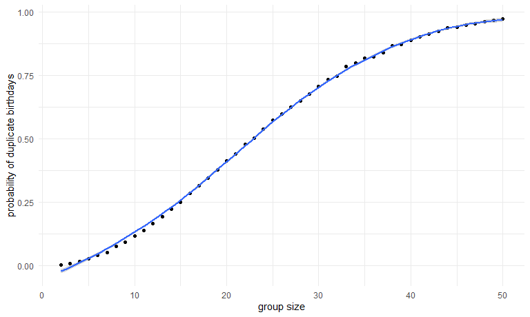

p8105_hw5_rw3031
================
Polly Wu (rw3031)
2024-11-03

# Problem 1

## simulation for birthday duplicate check

``` r
birthday_dup = function(n){
 date_list = sample(1:365, n, replace = TRUE)
 
 dup_btd = any(duplicated(date_list))

 return(dup_btd)
}

birthday_sim_df=
expand_grid(
  n=c(2:50),
  iter = 1:10000)|>
  mutate(
    output = map(n,birthday_dup))|>
  unnest(output)
```

## compute the probabilty of birthday duplicates

``` r
btd_dup_df=
birthday_sim_df|>
  group_by(n,output)|>
  summarise(count = n())|>
  pivot_wider(
    values_from = count,
    names_from = output,
    names_prefix = "count_"
  )|>
  rename(group_size=n)|>
  mutate(
    probability_of_dup = count_TRUE/10000
  )|>
  select(group_size,probability_of_dup)
```

    ## `summarise()` has grouped output by 'n'. You can override using the `.groups`
    ## argument.

``` r
btd_dup_df
```

    ## # A tibble: 49 × 2
    ## # Groups:   group_size [49]
    ##    group_size probability_of_dup
    ##         <int>              <dbl>
    ##  1          2             0.0024
    ##  2          3             0.0085
    ##  3          4             0.0167
    ##  4          5             0.0267
    ##  5          6             0.0399
    ##  6          7             0.0521
    ##  7          8             0.0751
    ##  8          9             0.0925
    ##  9         10             0.116 
    ## 10         11             0.139 
    ## # ℹ 39 more rows

## plot on relationship between sample size and probability of duplicates

``` r
btd_dup_df|>
  ggplot(aes(x=group_size, y=probability_of_dup))+geom_point()+geom_smooth()+
  labs(x="group size", y="probability of duplicate birthdays")
```

    ## `geom_smooth()` using method = 'loess' and formula = 'y ~ x'


The graph indicates that the group size is linearily associated with the
log of the probability of duplication within birth dates.

# Problem 2

``` r
t_test = function(mu){
  
  n=30
  sigma = 5
  
  x=rnorm(n,mean=mu,sd=sigma)
  
  output = t.test(x,mu=0, conf.level = 0.95)|>
              broom::tidy()
  
  return(output)
}

t_test(0)
```

    ## # A tibble: 1 × 8
    ##   estimate statistic p.value parameter conf.low conf.high method     alternative
    ##      <dbl>     <dbl>   <dbl>     <dbl>    <dbl>     <dbl> <chr>      <chr>      
    ## 1    -1.62     -2.00  0.0545        29    -3.26    0.0331 One Sampl… two.sided

# Problem 3
